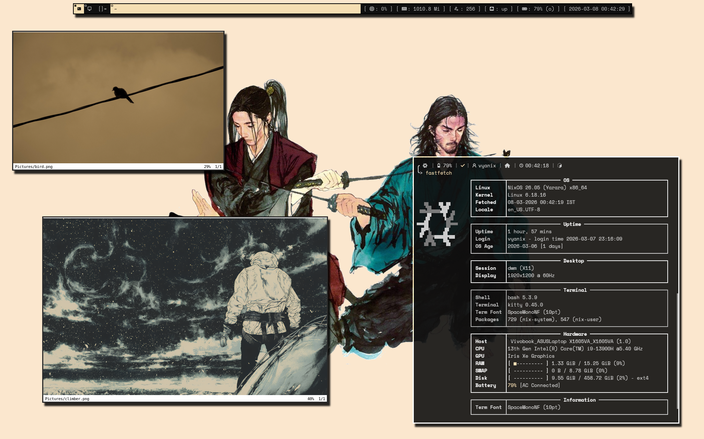

## vdots

Personal NixOS configuration and dotfiles. 
Minimal, reproducible, and developer-focused.

#### System Overview :
**OS**: NixOS (flakes-enabled)  
**WM**: dwm (X11)  
**Shell**: Bash  
**Term**: kitty  
**Editor**: Neovim / Emacs

#### Notes
These configs are tailored for my hardware and workflow. Use at your own risk. Expect breaking changes.
